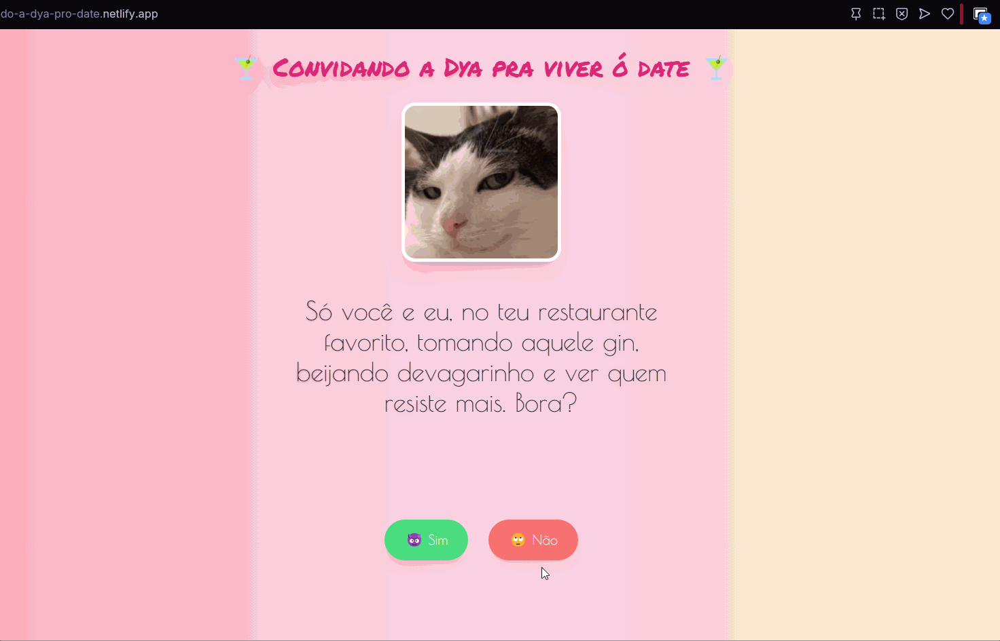

# 💌 Convite Irrecusável - Projeto Angular + Tailwind

Este projeto foi desenvolvido em **Angular 17** com **Tailwind CSS** e **SCSS**, para convidar uma gata de Tabuleiro do Norte para um encontro 🥂. A ideia era sair do comum e usar criatividade + programação para fazer um convite "irrecusável". Resultado? Uma experiência interativa, com efeitos, animações e até botão que foge 😅.

---

## ✨ Funcionalidades

- 📝 **Texto sendo digitado** automaticamente para criar suspense;
- 🎈 **Balão flutuante com convite** e horário do date;
- ✅ **Botão de confirmação** com link direto pro WhatsApp com mensagem personalizada;
- ❌ **Botão de recusa com proposta alternativa**, também via WhatsApp;
- 🏃‍♂️ **Botão “Não” que foge do mouse** (ela não vai escapar tão fácil assim! 😂);
- 🎨 Layout responsivo e visualmente romântico com **Tailwind** e **gradientes suaves**;
- 🧠 Desenvolvido com boas práticas Angular e componentes standalone.

---

## 🚀 Tecnologias Usadas

- **Angular 17**
- **Tailwind CSS**
- **SCSS**
- **TypeScript**
- **HTML5**

---

## 🛠️ Como rodar localmente

```bash
# Clone o repositório
git clone https://github.com/marcoscunhaa/Unmissable-Invitation.git

# Entre na pasta
cd Unmissable-Invitation

# Instale as dependências
npm install

# Rode a aplicação
ng serve
```

___

### 🎯 Aplicação em execução:


